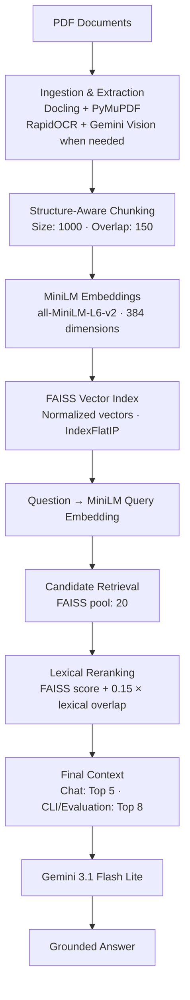
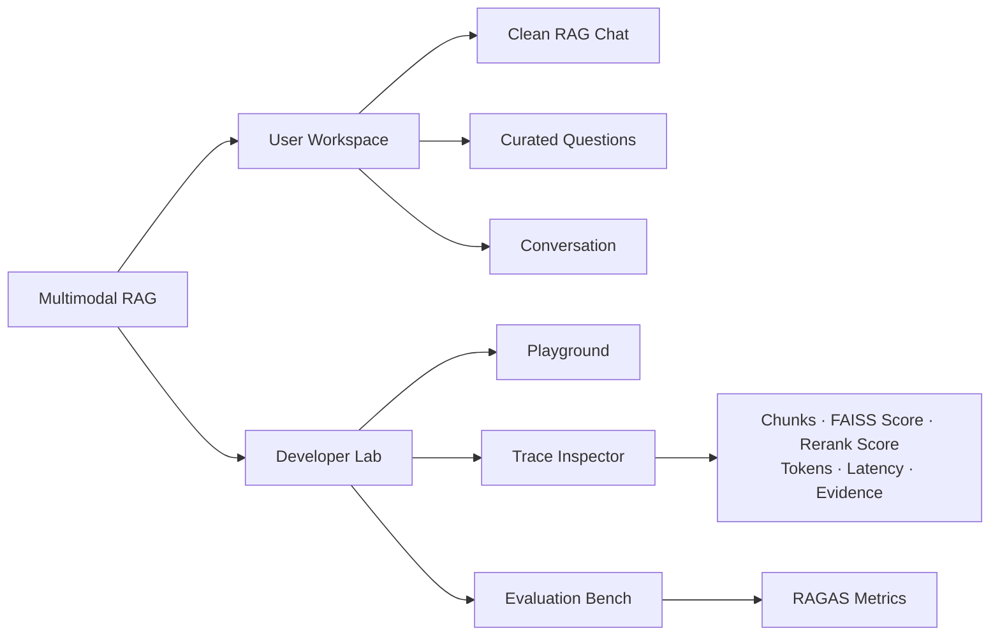
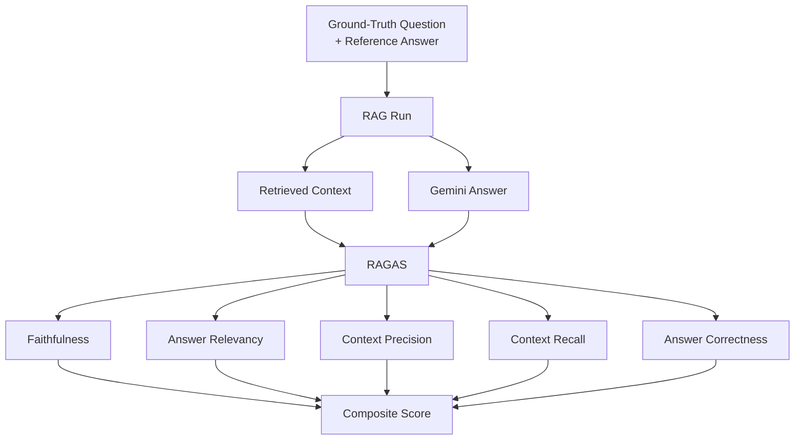

# Multimodal RAG for PDF Intelligence

[](https://www.python.org/)
[](https://streamlit.io/)
[](https://github.com/facebookresearch/faiss)
[](LICENSE)

A traceable multimodal RAG system for complex PDFs. It combines
layout-aware extraction, OCR and conditional vision understanding with
local embeddings, FAISS retrieval, lexical reranking, Gemini answer
generation, and built-in RAGAS evaluation.

The application is split into a clean **User Workspace** for document
Q&A and a **Developer Lab** for retrieval inspection, traces, latency,
token telemetry, and evaluation.

## What it does

``` text
PDF → Extract → Chunk → Embed → Index → Retrieve → Rerank → Gemini → Answer
```

The pipeline keeps document, page, section, extraction, and chunk
metadata throughout processing so the same evidence used for an answer
can also be inspected in the Developer Lab.

## Key features

-   Layout-aware PDF ingestion with **Docling** and **PyMuPDF**
-   Native extraction, **RapidOCR**, and conditional **Gemini Vision**
-   Structure-aware chunking with page and section metadata
-   Local `sentence-transformers/all-MiniLM-L6-v2` embeddings
-   384-dimensional normalized vectors
-   **FAISS** dense vector retrieval
-   Expanded candidate retrieval plus lexical reranking
-   **Gemini 3.1 Flash Lite** grounded answer generation
-   Reusable RAG traces with chunks, scores, latency, and token
    telemetry
-   Separate **User Workspace** and **Developer Lab**
-   Five-metric **RAGAS** evaluation
-   Question-wise and resumable batch evaluation

# Architecture

## 1. RAG pipeline



The ingestion stage first tries local document understanding. OCR and
Gemini Vision are used when the document region requires them; the
downstream RAG pipeline operates on the validated extracted content.

## 2. User Workspace and Developer Lab



**User Workspace** focuses on the answer and conversation. Technical
retrieval evidence stays out of the normal chat view.

**Developer Lab** can run test questions, inspect previously stored
traces, compare retrieved chunks and ranking scores, and explicitly run
RAGAS evaluation.

## 3. RAGAS evaluation



RAGAS is an explicit developer workflow---normal Chat does **not** run
evaluation. The evaluator defaults to local **Ollama `qwen2.5:7b`**,
with **Groq `openai/gpt-oss-20b`** available as an optional provider.

# How retrieval works

The retriever uses semantic similarity and lightweight lexical matching
together:

1.  The question is embedded once with `all-MiniLM-L6-v2`.
2.  FAISS searches an internal candidate pool of **20** chunks.
3.  Query/chunk lexical tokens are normalized so punctuation and hyphen
    variants such as `long-term` and `long term` are treated
    consistently.
4.  Candidates are reranked with:

``` text
combined_score = raw_faiss_score + 0.15 × lexical_overlap
```

5.  Only the caller-visible result count is returned:
    -   **Chat:** top 5
    -   **CLI:** top 8 by default
    -   **Evaluation:** top 8

`raw_faiss_score` represents dense semantic similarity.
`lexical_overlap` rewards direct term agreement. The combined score
determines final ranking while the raw similarity remains available for
developer inspection.

# Quickstart

The project requires **Python 3.10+**. The verified development
environment uses Python 3.11.

## 1. Clone and create the environment

``` powershell
git clone https://github.com/Cosmos-Krishna/multimodal-rag.git
Set-Location multimodal-rag

py -3.11 -m venv .venv
.\.venv\Scripts\Activate.ps1
python -m pip install --upgrade pip
```

Once `(.venv)` is visible in the terminal, the shorter `python -m ...`
commands below are enough.

## 2. Install the application

``` powershell
python -m pip install -r requirements.txt
python -m pip install --no-deps --no-build-isolation -e .
```

The evaluation stack is installed separately in the currently verified
environment:

``` powershell
python -m pip install `
  ragas==0.3.5 `
  langchain==0.3.30 `
  langchain-core==0.3.86 `
  langchain-community==0.3.31 `
  langchain-text-splitters==0.3.11 `
  langchain-groq==0.2.4 `
  langchain-ollama==0.2.3 `
  langchain-huggingface==0.3.1 `
  datasets==5.0.0 `
  pandas==3.0.3 `
  tqdm==4.68.4 `
  tenacity==9.1.4 `
  python-dotenv==1.2.2
```

## 3. Configure Gemini

``` powershell
$env:GEMINI_API_KEY = "your-gemini-key"
```

Gemini is used for answer generation and for ingestion regions that
require Vision escalation.

## 4. Configure the RAGAS evaluator

### Local Ollama

``` powershell
ollama pull qwen2.5:7b
ollama serve
$env:EVALUATOR_PROVIDER = "ollama"
```

### Optional Groq

``` powershell
$env:EVALUATOR_PROVIDER = "groq"
$env:GROQ_API_KEY = "your-groq-key"
```

The default Groq evaluator model is `openai/gpt-oss-20b`.

## 5. Provision the embedding model once

Runtime embedding is intentionally local/cache-based. Provision the
exact model before indexing on a fresh machine:

``` powershell
python -c "from sentence_transformers import SentenceTransformer; SentenceTransformer('sentence-transformers/all-MiniLM-L6-v2')"
```

After it is cached, normal project execution loads it locally.

# From PDF to RAG answer

## 1. Add a PDF

Place the PDF in:

``` text
data/input/
```

Example:

``` text
data/input/my-document.pdf
```

## 2. Ingest and extract

``` powershell
python -m multimodal_rag.cli.ingest "data/input/my-document.pdf"
```

This performs layout analysis, extraction, validation, cleaning,
structure-aware chunking, and artifact generation.

## 3. Build embeddings and FAISS index

``` powershell
python -m multimodal_rag.cli.build_index
```

Document chunks are embedded locally with MiniLM and stored in the FAISS
index.

## 4. Ask one RAG question

``` powershell
python -m multimodal_rag.cli.ask "What are the key elements of robust AI governance?"
```

The CLI prints the retrieved evidence and then the Gemini-generated
answer.

# Evaluation

The repository supports both **one-question evaluation** for debugging
and **batch evaluation** for benchmarking.

## Evaluate one ground-truth question

By ID:

``` powershell
python -m multimodal_rag.evaluation.question_runner --id 1
```

By exact question:

``` powershell
python -m multimodal_rag.evaluation.question_runner --question "What are the five dimensions of AI readiness?"
```

Interactive selection:

``` powershell
python -m multimodal_rag.evaluation.question_runner --interactive
```

The question-wise evaluator runs one top-8 RAG trace and one RAGAS
evaluation, then reports the generated answer, retrieved chunks, scores,
latency, model information, and five RAGAS metrics.

## Run the batch evaluator

``` powershell
python -m multimodal_rag.evaluation.runner
```

Batch evaluation uses the ground-truth dataset in:

``` text
evaluation/datasets/ground_truth.json
```

and maintains provider-specific evaluation outputs under
`data/evaluation/`.

# Launch the UI

``` powershell
python -m streamlit run src/multimodal_rag/ui/streamlit_app.py
```

The Streamlit application exposes two clear workflows.

## User Workspace

Designed for normal document Q&A:

-   clean conversational interface
-   curated starter questions
-   bounded conversation context
-   one RAG execution per submitted question
-   technical trace details hidden from the normal user view

## Developer Lab

Designed for RAG engineering and evaluation:

### Playground / Trace

-   run a developer test question
-   inspect previous traced questions
-   view ranked retrieved chunks
-   compare raw FAISS and combined rerank scores
-   inspect retrieval and generation latency
-   inspect token telemetry when available
-   inspect complete evidence and metadata

### Evaluation Bench

-   choose one ground-truth record
-   compare reference and generated answers
-   inspect five RAGAS metrics
-   view composite score
-   inspect RAG and evaluation timing
-   inspect evaluator/provider telemetry

Evaluation runs only after an explicit action.

# Tech stack

  ----------------------------------------------------------------------------------
  Layer                   Technology                         Role
  ----------------------- ---------------------------------- -----------------------
  Language                Python 3.10+                       Core application

  PDF / layout            Docling + PyMuPDF                  Document structure,
                                                             rendering, and
                                                             extraction

  OCR                     RapidOCR                           Local OCR fallback

  Vision                  Gemini Vision                      Complex visual-region
                                                             understanding when
                                                             needed

  Chunking                Structure-aware aggregation +      Context-preserving
                          `RecursiveCharacterTextSplitter`   chunks

  Embeddings              `all-MiniLM-L6-v2`                 Local 384d dense
                                                             embeddings

  Vector index            FAISS                              Dense similarity
                                                             retrieval

  Ranking                 FAISS + lexical overlap            Candidate reranking

  Generation              `gemini-3.1-flash-lite`            Grounded answer
                                                             generation

  Evaluation              RAGAS                              Five-metric RAG
                                                             evaluation

  Evaluators              Ollama / Groq                      Local or external
                                                             evaluation models

  UI                      Streamlit                          User Workspace +
                                                             Developer Lab
  ----------------------------------------------------------------------------------

# Project structure

``` text
multimodal-rag/
├── src/multimodal_rag/
│   ├── ingestion/          # PDF analysis, extraction, validation, chunking
│   ├── rag/                # embeddings, FAISS, retrieval, generation, traces
│   ├── cli/                # ingest, index, and ask commands
│   ├── evaluation/         # batch and question-wise RAGAS evaluation
│   ├── ui/                 # Streamlit application
│   └── tools/              # diagnostics and comparison utilities
│
├── data/
│   ├── input/              # source PDFs
│   ├── artifacts/          # ingestion artifacts and FAISS index
│   ├── evaluation/         # evaluation outputs
│   └── logs/               # runtime logs
│
├── evaluation/
│   └── datasets/           # ground-truth dataset
│
├── docs/
│   ├── ARCHITECTURE_REFERENCE.md
│   └── PROJECT_STATUS.md
│
├── tests/
├── AGENTS.md
├── requirements.txt
└── pyproject.toml
```

# Testing

Run the complete automated suite with:

``` powershell
python -m pytest
```

The latest verified working-tree baseline passed **65 tests**. Provider
interactions are mocked during automated tests, so normal test execution
does not require live Gemini, Groq, Ollama, or RAGAS calls.

# Processing boundaries

Most document processing stays local:

  Stage                               Processing
  ----------------------------------- ------------------------------
  PDF loading and layout inspection   Local
  Docling analysis                    Local
  RapidOCR                            Local
  Cleaning and chunking               Local
  MiniLM embeddings                   Local
  FAISS search and reranking          Local
  Gemini Vision                       External, only when required
  Gemini answer generation            External
  Ollama evaluation                   Local
  Groq evaluation                     External, optional

# Deeper documentation

The GitHub README intentionally stays focused on the system and how to
run it.

For implementation-level details:

-   [`docs/ARCHITECTURE_REFERENCE.md`](docs/ARCHITECTURE_REFERENCE.md)
    --- detailed pipeline architecture, routing, trace boundaries,
    evaluator behavior, and artifacts.
-   [`docs/PROJECT_STATUS.md`](docs/PROJECT_STATUS.md) --- current
    repository state and handoff context.
-   [`AGENTS.md`](AGENTS.md) --- concise context for coding agents
    working on the repository.

# Future improvements

The architecture is designed to support further experimentation with:

-   stronger hybrid retrieval and structural ranking
-   table- and figure-aware retrieval
-   visual embeddings
-   GraphRAG for multi-hop or corpus-global questions
-   persistent conversation and evaluation history
-   richer document management and evidence navigation

# License

This project is licensed under the [MIT License](LICENSE).
