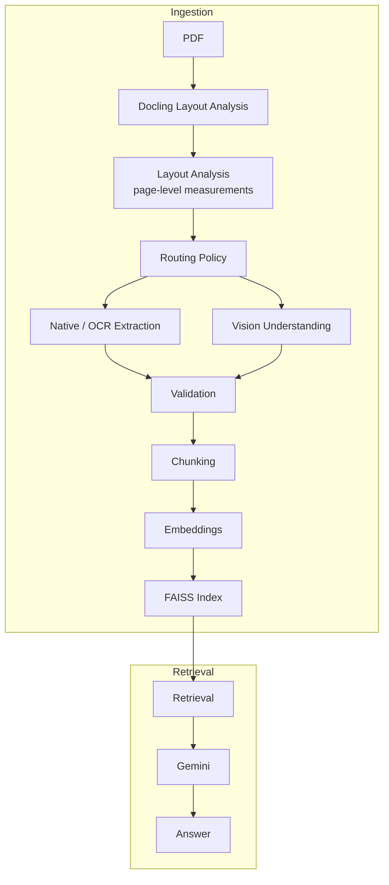

# PDF RAG Pipeline

A retrieval-augmented question-answering system for PDF documents, built around a layout-aware ingestion pipeline. Rather than treating every page as flat text, the pipeline analyzes document layout to decide, per page, whether native extraction, OCR, or vision-based understanding is required. Extraction results are validated region by region before chunking, embedding, and indexing, so answers are grounded in content that has actually passed a quality check rather than raw extraction output.

## Features

- **Docling-based document parsing** — structural layout analysis of PDF pages into typed regions: text, headings, tables, figures, and captions, with bounding boxes and reading order
- **Layout-aware document analysis** — per-page structural measurements (region density, text fragmentation, bounding-box alignment) used to characterize how visually complex a page is, independent of extraction quality
- **OCR fallback** — RapidOCR-based text recovery for pages where native text extraction is unreliable, such as broken font mappings or scanned pages
- **Vision-based understanding for complex visual regions** — Gemini Vision invoked for pages identified as infographic-style (comparison matrices, diagrams, multi-column visual layouts) where structure, not just text, carries meaning
- **Region-level validation** — every extracted region is checked against content-quality rules before being accepted, with a fallback chain (native → OCR → Vision) and a recorded reason for each outcome
- **Semantic chunking** — chunking that respects section and page boundaries rather than splitting on raw character counts alone
- **Local embeddings** — sentence-transformer embeddings computed locally, no external embedding API or per-query cost
- **FAISS indexing** — vector similarity search over the embedded chunk corpus
- **Retrieval-Augmented Generation** — retrieved chunks passed to Gemini as grounding context for answer generation
- **Streamlit interface** — interactive Chat and single-question Evaluation workspaces with source and retrieval diagnostics

## Architecture



The Routing Policy decides, per page, which extraction paths to use based on layout measurements — it does not perform extraction itself. Layout analysis, in turn, only measures; it never decides. Keeping "what does this page look like" and "what should we do about it" as separate stages means new routing rules can be added without touching how pages are measured, and vice versa.

Validation is the single point where extracted content — from native text, OCR, or Vision — is checked against content-quality rules before proceeding to chunking. A region that fails validation falls back to the next extraction method in the chain rather than being silently dropped or accepted as-is.

## Project Structure

```
.
├── src/multimodal_rag/
│   ├── ingestion/                     # layout-aware PDF ingestion
│   ├── rag/                           # embeddings, indexing, retrieval, generation
│   ├── cli/                           # canonical command-line implementations
│   ├── ui/                            # Streamlit applications
│   ├── evaluation/                    # evaluation runner
│   └── tools/                         # comparison and diagnostics tools
├── data/
│   ├── input/                         # source PDFs
│   ├── artifacts/                     # ingestion outputs, figures, and FAISS index
│   ├── comparisons/                   # extraction comparison outputs
│   ├── evaluation/                    # generated evaluation reports
│   └── logs/                          # runtime logs
├── tests/                              # deterministic regression tests
└── requirements.txt / pyproject.toml
```

## Tech Stack

| Component | Technology | Purpose |
|---|---|---|
| Language | Python (3.10+) | Core implementation language |
| Document parsing / layout analysis | Docling | Structural region segmentation and reading order |
| Page/region rendering | PyMuPDF | Rendering pages/regions to images for OCR and Vision |
| OCR fallback | RapidOCR | Text recovery when native extraction is unreliable |
| Vision understanding & answer generation | Gemini (`gemini-3.1-flash-lite` for answers) | Structural description of complex pages and grounded answer generation |
| Embeddings | Sentence Transformers (`all-MiniLM-L6-v2`) | Local, cost-free dense chunk embeddings |
| Vector index | FAISS | Similarity search over embedded chunks |
| UI | Streamlit | Interactive Chat, Evaluation, sources, and developer diagnostics |

Every configurable stage (layout analysis thresholds, routing policy thresholds, validation rules, chunking parameters) is driven by a dedicated, typed config object rather than scattered constants, so behavior can be tuned per stage without touching extraction logic.

## Installation

Requires Python 3.10 or later (the codebase uses modern type-hint syntax throughout).

```bash
# Clone the repository
git clone https://github.com/Cosmos-Krishna/multimodal-rag.git
cd multimodal-rag

# Create a virtual environment
python -m venv .venv
source .venv/bin/activate   # Windows: .venv\Scripts\activate

# Install dependencies
pip install -r requirements.txt

# Install the project package in editable mode
python -m pip install --no-deps -e .
```

Vision-based understanding and answer generation require a Gemini API key:

```bash
export GEMINI_API_KEY="your-api-key"   # Windows: set GEMINI_API_KEY=your-api-key
```

Without a key, the pipeline still runs end-to-end using native extraction and OCR only; vision-based escalation and Gemini-generated answers are skipped.

## Usage

```bash
# Run the full ingestion pipeline on a PDF
python -m multimodal_rag.cli.ingest path/to/document.pdf

# Build the FAISS index from generated embeddings
python -m multimodal_rag.cli.build_index

# Ask a question from the command line
python -m multimodal_rag.cli.ask "What are the long-term technology implications?"

# Launch the interactive UI
python -m streamlit run src/multimodal_rag/ui/streamlit_app.py
```

Runtime files use the modular `data/` layout; legacy runtime directories are read as temporary
fallbacks when the corresponding new directory is absent.

The CLI ask command prints the retrieved chunks (with page number and similarity score) followed by the generated answer, so retrieval quality can be inspected alongside the final response rather than only seeing the end result.

### Evaluation

The existing batch evaluator retains its resumable behavior: it loads the full
ground-truth dataset, skips IDs already present in the active provider CSV,
appends each completed result, and regenerates the provider report.

```powershell
.venv\Scripts\python.exe -m multimodal_rag.evaluation.runner
```

For an isolated developer trace, select exactly one ground-truth item by ID,
exact normalized question text, or interactively:

```powershell
.venv\Scripts\python.exe -m multimodal_rag.evaluation.question_runner --id 8
.venv\Scripts\python.exe -m multimodal_rag.evaluation.question_runner --question "What is the difference between the short-term and long-term technology implications of AI in marketing?"
.venv\Scripts\python.exe -m multimodal_rag.evaluation.question_runner --interactive
```

The question-wise evaluator is print-only. It does not read batch completion
state or write evaluation CSVs, reports, the ground-truth dataset, the FAISS
index, or other runtime artifacts. Its output includes the complete text and
available ingestion metadata for every retrieved chunk, raw FAISS similarity
and combined rerank scores, model and retriever details, timing, available
Gemini/evaluator token telemetry, and all existing per-question RAGAS metrics.

## Pipeline Workflow

1. **Load** the PDF and extract native text and font metadata per page, flagging pages where font mappings look unreliable.
2. **Pre-analyze** each page for signals such as broken font mappings or scan likelihood — these signals inform later routing but don't decide anything themselves.
3. **Segment layout** with Docling into typed regions (text, table, figure) with bounding boxes and reading order.
4. **Compute layout measurements** per page — region density, text fragmentation, and bounding-box grid alignment, aggregated from the region list.
5. **Decide routing** per page — whether native extraction, OCR, and/or Vision should be used, based purely on the measurements above.
6. **Extract** each region via native text or OCR, and render full pages for Vision on pages routed to it.
7. **Validate** every extracted region against content-quality checks, falling back through the extraction chain (native → OCR → Vision) as needed, with the reason for each fallback recorded.
8. **Chunk** validated content into retrieval-sized units, preserving page number and section metadata on each chunk.
9. **Embed** chunks locally with a sentence-transformer model and build a FAISS index over the resulting vectors.
10. **Retrieve and answer** — embed the incoming query, retrieve and rerank relevant chunks from the index, and generate a grounded answer with Gemini using only the retrieved context.

## Output

Ingestion produces, per document, a self-contained output folder containing:

- `chunks.json` — final chunked content, each entry tagged with page number, section title, and source region IDs
- `metadata.json` — embedding metadata: model name, embedding dimension, and the join between chunks and their vectors
- `validation_report.json` — per-region validation outcomes, including which extraction method was ultimately used and why any fallback occurred

These files are consumed directly by the embedding and retrieval stages and are also useful on their own for auditing how a given page was extracted.

## Future Improvements

- Hybrid retrieval combining lexical and dense signals
- Metadata-aware retrieval (filtering by section, page range, or document)
- Cross-document search across multiple ingested PDFs
- Multi-language document support
- Cross-encoder reranking of retrieved chunks
- Automatic tuning of routing thresholds based on validation outcomes

## License

MIT
