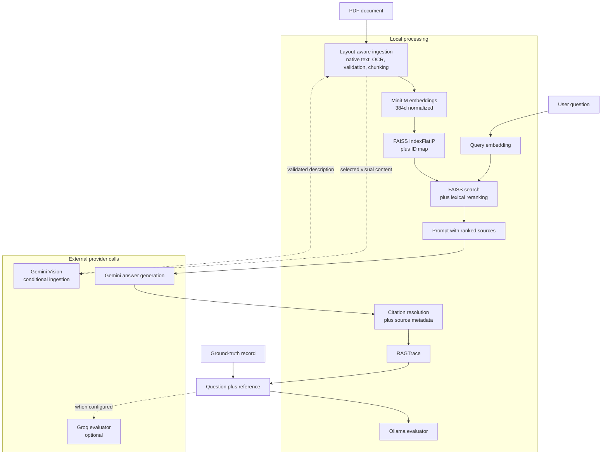
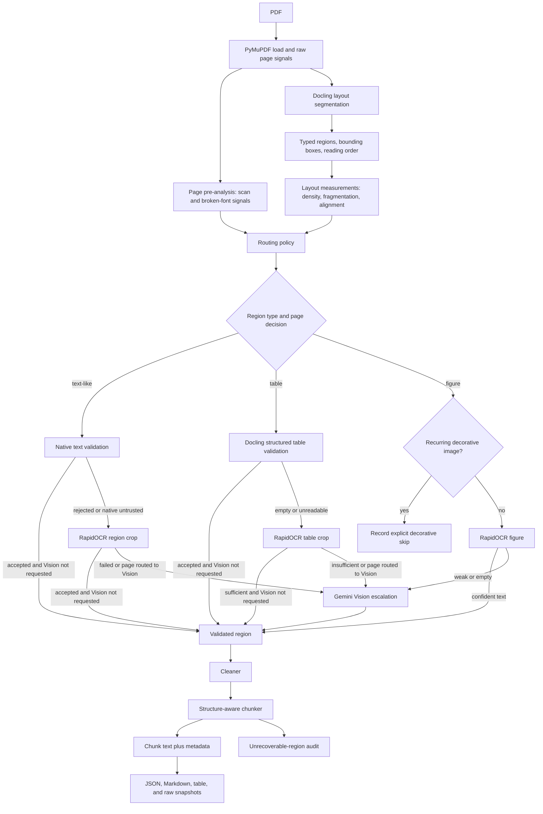
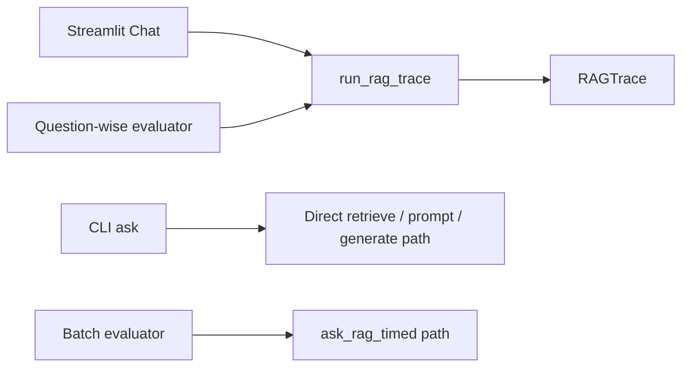
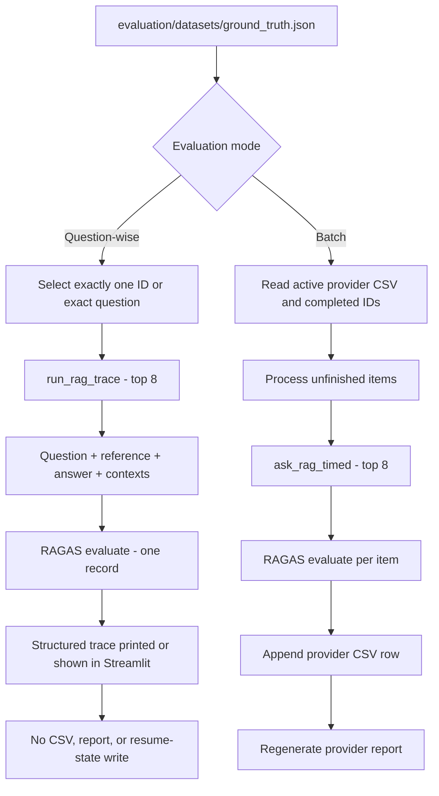

# Multimodal RAG for PDF Intelligence

[](https://www.python.org/)
[](https://streamlit.io/)
[](https://github.com/facebookresearch/faiss)
[](LICENSE)

This project turns PDFs into a layout-aware, auditable retrieval-augmented generation system. It separates document measurement from routing, validates extracted regions before chunking, embeds content locally, retrieves with dense similarity plus lexical reranking, and uses Gemini to generate grounded answers. A Streamlit application provides normal Chat, an optional Developer trace, and an isolated single-question RAGAS workspace.

## Feature summary

- Layout-aware PDF ingestion with Docling and PyMuPDF
- Native text, RapidOCR, and conditional Gemini Vision extraction paths
- Page routing based on measured scan, font, fragmentation, and alignment signals
- Region-level validation with explicit fallback and failure records
- Structure-aware chunking that retains document, page, section, and extraction metadata
- Local `sentence-transformers/all-MiniLM-L6-v2` embeddings
- 384-dimensional normalized vectors and FAISS `IndexFlatIP` search
- Lexical overlap reranking while preserving the raw FAISS score
- Gemini `gemini-3.1-flash-lite` answer generation and provider token metadata
- Resolved citation markers when present, with Streamlit source-metadata fallback
- Shared `RAGTrace` for Streamlit Chat and question-wise evaluation
- Five-metric RAGAS evaluation through local Ollama or optional Groq
- Resumable batch evaluation plus a print-only, one-question evaluator
- Streamlit Chat, Developer Mode, and display-only Evaluation workspace

## Two ways to use the project

| Workflow | Flow | Intended user |
|---|---|---|
| Normal RAG | PDF -> ingest -> index -> ask -> answer + source metadata | Someone querying the knowledge base |
| Developer evaluation | Ground-truth item -> retrieval -> Gemini answer -> chunks/scores/telemetry -> RAGAS metrics | Someone debugging or comparing the pipeline |

Normal Chat does **not** invoke RAGAS. Evaluation is an explicit, slower workflow that sends a question, reference answer, generated answer, and retrieved contexts to the configured evaluator.

## Quickstart: PDF to answer and evaluation

The canonical environment is `.venv`. The repository requires Python 3.10 or later; the current verified environment uses Python 3.11.9.

### 1. Create the virtual environment

```powershell
git clone https://github.com/Cosmos-Krishna/multimodal-rag.git
Set-Location multimodal-rag

py -3.11 -m venv .venv
.\.venv\Scripts\python.exe -m pip install --upgrade pip
```

### 2. Install the base application and editable package

```powershell
.\.venv\Scripts\python.exe -m pip install -r requirements.txt
.\.venv\Scripts\python.exe -m pip install --no-deps --no-build-isolation -e .
```

`requirements.txt` covers ingestion, embedding, FAISS, generation, and Streamlit. It does **not** currently declare the complete evaluation stack.

To reproduce the evaluation packages in the verified `.venv`, install the following separately:

```powershell
.\.venv\Scripts\python.exe -m pip install `
  ragas==0.3.5 `
  langchain==0.3.30 `
  langchain-core==0.3.86 `
  langchain-community==0.3.31 `
  langchain-text-splitters==0.3.11 `
  langchain-groq==0.2.4 `
  langchain-ollama==0.2.3 `
  langchain-huggingface==0.3.1 `
  datasets==5.0.0 `
  pandas==3.0.3 `
  tqdm==4.68.4 `
  tenacity==9.1.4 `
  python-dotenv==1.2.2
```

This is the currently working environment, not a clean dependency lock: `pip check` reports known LangChain-family and PDF-tool conflicts. See [Limitations](#limitations) and [Project status](docs/PROJECT_STATUS.md) before changing dependency versions.

### 3. Configure provider credentials safely

Set secrets in the current PowerShell session or in an ignored local `.env` file. Never commit real keys.

```powershell
$env:GEMINI_API_KEY = "your-gemini-key"
```

`GEMINI_API_KEY` is required for normal answer generation and for any ingestion region escalated to Gemini Vision. Ingestion can still complete without Vision when local native/OCR fallback is sufficient; normal RAG answer generation cannot.

RAGAS defaults to local Ollama:

```powershell
ollama pull qwen2.5:7b
ollama serve
$env:EVALUATOR_PROVIDER = "ollama"
```

To select Groq instead:

```powershell
$env:EVALUATOR_PROVIDER = "groq"
$env:GROQ_API_KEY = "your-groq-key"
# Optional override; the code default is openai/gpt-oss-20b
$env:GROQ_MODEL = "openai/gpt-oss-20b"
```

### 4. Provision the local embedding-model cache

Production embedding loads use `local_files_only=True`, while `HF_HUB_OFFLINE` and `TRANSFORMERS_OFFLINE` default to `1`. A fresh machine therefore needs the exact model cached once before indexing or retrieval.

If the model is not already cached, temporarily allow a one-time model download:

```powershell
$env:HF_HUB_OFFLINE = "0"
$env:TRANSFORMERS_OFFLINE = "0"
.\.venv\Scripts\python.exe -c "from sentence_transformers import SentenceTransformer; SentenceTransformer('sentence-transformers/all-MiniLM-L6-v2'); print('Embedding model cached')"
$env:HF_HUB_OFFLINE = "1"
$env:TRANSFORMERS_OFFLINE = "1"
```

This downloads only the configured embedding model. PDF content is not involved in this provisioning step. Normal project execution subsequently loads the cached model locally.

### 5. Ingest one PDF

```powershell
.\.venv\Scripts\python.exe -m multimodal_rag.cli.ingest path\to\document.pdf
```

The command performs PDF loading, page pre-analysis, Docling layout segmentation, layout measurement, routing, native/OCR/Vision extraction as applicable, validation, cleaning, structure-aware chunking, and audit-output writing. Omitting the PDF path processes every `*.pdf` in `data/input/`.

### 6. Build embeddings and the FAISS index

```powershell
.\.venv\Scripts\python.exe -m multimodal_rag.cli.build_index
```

This embeds new document chunks with `sentence-transformers/all-MiniLM-L6-v2`, writes 384-dimensional normalized vectors, and rebuilds the corpus-wide FAISS index and ID map.

### 7. Ask one normal RAG question

```powershell
.\.venv\Scripts\python.exe -m multimodal_rag.cli.ask "What does Enterprise AI mean?"
```

The CLI retrieves eight chunks by default, prints each chunk's raw FAISS score, page metadata, and an 800-character text preview, then prints the Gemini answer. It prints resolved sources only if citation markers are present in the model response.

Use a different retrieval count without changing the default:

```powershell
.\.venv\Scripts\python.exe -m multimodal_rag.cli.ask "What does Enterprise AI mean?" --top-k 3
```

The CLI does not currently print the combined rerank score. That value is available in Streamlit Developer Mode and the question-wise evaluator.

### 8. Run one print-only RAG + RAGAS evaluation

```powershell
.\.venv\Scripts\python.exe -m multimodal_rag.evaluation.question_runner --id 1
```

Selection is also supported by exact normalized question text or interactively:

```powershell
.\.venv\Scripts\python.exe -m multimodal_rag.evaluation.question_runner --question "What does 'Enterprise AI' mean according to the playbook?"
.\.venv\Scripts\python.exe -m multimodal_rag.evaluation.question_runner --interactive
```

The runner selects exactly one of the 25 ground-truth records and executes:

```text
ground truth -> top-8 RAG trace -> Gemini answer -> one-record RAGAS evaluation
```

Terminal output includes the reference and generated answers, complete retrieved chunk text, raw FAISS and combined rerank scores, metadata, model details, latency, available generation/evaluator tokens, estimated evaluator cost, five RAGAS metrics, and their unweighted composite. Unavailable provider telemetry is labeled rather than estimated.

> This mode is print-only. It does not read completed batch IDs, save results, update reports, or alter batch resume state.

### 9. Run resumable batch RAGAS evaluation

```powershell
.\.venv\Scripts\python.exe -m multimodal_rag.evaluation.runner
```

The batch runner loads all 25 ground-truth items, reads the active provider CSV, skips completed IDs, evaluates remaining items one at a time, appends each completed row immediately, and regenerates the provider report after every success.

Provider-specific files are kept separate:

```text
data/evaluation/results_ollama.csv
data/evaluation/evaluation_report_ollama.md
data/evaluation/results_groq.csv
data/evaluation/evaluation_report_groq.md
```

### 10. Launch Streamlit

```powershell
.\.venv\Scripts\python.exe -m streamlit run src/multimodal_rag/ui/streamlit_app.py
```

The application exposes:

- **Chat** — grounded Q&A, source cards, short conversation memory, and top-5 retrieval.
- **Developer Mode** — a collapsed per-answer trace with ranking scores, full chunks, metadata, timings, models, token usage, and citation diagnostics.
- **Evaluation** — an explicit, display-only top-8 evaluation for one selected ground-truth ID. It runs only after clicking the button and stores the latest result only in session state.

The repository does not currently contain screenshots. Recommended future paths are `docs/images/chat.png`, `docs/images/developer-mode.png`, and `docs/images/evaluation.png`; no placeholder image files are included.

## High-level architecture



The local/external boundary is deliberate: parsing, OCR, embedding, FAISS search, and reranking are local. Gemini receives rendered content only when Vision escalation occurs and receives retrieved text context for answer generation. Groq receives evaluation data only when explicitly selected and an evaluation is run.

## Ingestion architecture



Routing flags are independent: an infographic-like page can enable native extraction, OCR, and Gemini together. Validation—not routing—decides whether content is acceptable. The implementation also contains a documented proof-of-concept whole-page Gemini path for hard-coded pages 21, 28, 32, and 34; replacing that with a routing-derived signal remains technical debt.

## Retrieval and generation architecture

```mermaid
flowchart LR
    Q[Question] --> QE[MiniLM query embedding]
    QE --> FS[FAISS top-k candidate search]
    FS --> Raw[Preserved raw FAISS score]
    Q --> QT[Normalized query token set]
    FS --> CT[Normalized chunk token set]
    QT --> Overlap[Lexical overlap]
    CT --> Overlap
    Raw --> Combined[raw score + 0.15 x lexical overlap]
    Overlap --> Combined
    Combined --> Rank[Final descending ranking]
    Rank --> Filter[Filter by raw min_score]
    Filter --> Context[Ranked source blocks S1 to Sk]
    Context --> Prompt[Grounding prompt]
    Q --> Prompt
    Prompt --> Gemini[Gemini 3.1 Flash Lite]
    Gemini --> Answer[Generated answer plus usage metadata]
    Answer --> Resolver[Citation resolver]
    Context --> Resolver
    Resolver --> Trace[RAGTrace or caller-specific output]
```



### Retrieval scoring

The active implementation is `src/multimodal_rag/rag/retrieval/retriever_2.py`.

Let `Q` be the set of lowercase query tokens and `C` the set of lowercase chunk tokens. Tokenization uses the regular expression `[a-z0-9-]+`, removes a fixed English stopword set, and retains hyphenated terms.

```text
lexical_overlap = |Q intersection C| / |Q|          when Q is non-empty
lexical_overlap = 0                                 otherwise

combined_rerank_score = raw_score + 0.15 * lexical_overlap
```

- **Raw score** — inner product returned by FAISS. Because both corpus and query vectors are normalized, it is cosine similarity.
- **Lexical overlap** — the fraction of non-stopword query terms also present in the chunk; it is query-normalized, not Jaccard similarity.
- **Combined rerank score** — determines final descending order when lexical reranking is enabled.
- **Filtering** — `min_score` is applied to the preserved raw FAISS score after reranking; its default is `0.0`.
- **Candidate count** — FAISS is asked for the caller's `top_k`, then those candidates are reranked. The reranker does not fetch a larger candidate pool.

| Caller | Top-k | Combined score visible? |
|---|---:|---|
| Streamlit Chat | 5 | Yes, in Developer Mode |
| CLI `multimodal_rag.cli.ask` | 8 by default; configurable | No; CLI prints raw score only |
| Question-wise evaluation | 8 | Yes |
| Batch evaluation | 8 | Persisted metrics do not expose per-chunk scores |

Every retrieved result retains `chunk_id`, `document_id`, source filename, pages, section title, complete chunk text, raw score, and optional combined score. `RAGTrace` enriches results with the matching ingestion metadata from existing `chunks.json` files.

## Shared trace and caller boundaries

`run_rag_trace()` in `src/multimodal_rag/rag/trace.py` performs one retrieval, one prompt build, one generation, citation resolution, metadata enrichment, and stage timing.



The shared trace currently serves Streamlit Chat and question-wise evaluation only. The CLI and batch runner remain independent paths and should not be presented as trace consumers.

Key trace concepts include:

- Generated answer, resolved citations, and uncited source records
- Retrieved rank, raw FAISS score, combined rerank score, full text, and ingestion metadata
- Retriever module, embedding model, generation model, configured top-k, and actual result count
- Retrieval, generation, and complete-RAG latency
- Gemini prompt, completion, and total tokens when returned by the SDK
- `estimated_generation_cost`, currently unavailable because generation pricing is not calculated

## Evaluation architecture



### Evaluators

| Configuration | Model | Location | Notes |
|---|---|---|---|
| Default | Ollama `qwen2.5:7b` | Local Ollama server | Used when `EVALUATOR_PROVIDER` is missing or invalid |
| Optional | Groq `openai/gpt-oss-20b` | External Groq API | Selected with `EVALUATOR_PROVIDER=groq`; model can be overridden by `GROQ_MODEL` |

Groq uses direct `ChatGroq.model_copy(update=...)` clones for two metrics whose structured generations can exceed provider-default output limits:

| RAGAS metric | Groq configuration | What it measures in this project |
|---|---|---|
| Faithfulness | Dedicated evaluator, `max_tokens=4096` | Whether claims in the generated response are supported by retrieved contexts |
| Answer Relevancy | `strictness=1` | Similarity between the original question and one evaluator-generated question derived from the response; Groq supports only `n=1` |
| Context Precision | Shared evaluator defaults | Whether contexts useful for the reference are ranked ahead of less useful contexts |
| Context Recall | Shared evaluator defaults | Whether retrieved contexts cover claims needed by the reference answer |
| Answer Correctness | Dedicated evaluator, `max_tokens=4096` | Factual and semantic agreement between generated and reference answers |

Ollama uses the standard shared metric instances and retains RAGAS's default Answer Relevancy strictness. The per-question composite is the unweighted mean of whichever of the five metric values are available; it is a summary, not a substitute for inspecting each metric.

### Evaluation modes

| Mode | Purpose | Saves results | Resume behavior | Runs RAGAS |
|---|---|---:|---|---:|
| Batch | Evaluate the full dataset over time | Yes, provider CSV and report | Yes, skips completed IDs | Yes |
| Question-wise CLI | Debug one ground-truth item | No | No; ignores batch completion state | Yes |
| Streamlit Evaluation | Display one ground-truth evaluation | No; session memory only | No | Yes, only after button click |
| Chat | Normal document Q&A | No | Not applicable | No |
| Developer Mode | Inspect a stored Chat trace | No | Not applicable | No |

## Developer observability

Streamlit Developer Mode and the question-wise evaluator expose, where available:

- Final retrieved rank
- Raw FAISS similarity and combined rerank score
- Chunk ID, document ID/name, page, section, and complete chunk text
- Layout type, extraction method, confidence, validation status, pipeline version, and source-region references from ingestion metadata
- Resolved citations plus retrieved-source diagnostics
- Retriever implementation, embedding model, generation model, evaluator provider/model
- Configured top-k and actual retrieved count
- Retrieval, generation, complete-RAG, evaluation, and total latency as applicable
- Gemini prompt, completion, and total tokens returned in `usage_metadata`
- Aggregate evaluator input/output/total tokens and estimated evaluator cost when RAGAS and the provider expose them
- All five RAGAS metrics and the composite in evaluation modes

Telemetry is never fabricated. Provider-omitted usage fields, generation cost, unresolved metadata, or failed metric outputs remain explicitly unavailable.

## Streamlit user experience

### Chat

- Persistent chat input and bounded five-turn prompt memory
- One retrieval and one Gemini generation per submitted question
- Answer followed by compact source cards
- Resolved marker numbers when available; document/page/section fallback otherwise
- Stored answer traces prevent provider calls from repeating on ordinary Streamlit reruns

### Developer Mode

- Off by default and available only in the Chat workspace
- Collapsed per-answer panel organized around pipeline, performance, models, token usage, citations, and retrieved chunks
- Complete chunk text remains inside per-chunk expanders
- Toggling the panel reads the stored trace; it does not rerun retrieval or generation

### Evaluation

- Ground-truth selection by ID with canonical question, type, and difficulty
- No evaluation on page load or selector change
- Explicit run button with provider/quota warning
- Reference/generated answer, metric cards, timings, models, token/cost telemetry, sources, and full retrieved chunks
- Latest result stored in session state only; changing the ID clears the stale evaluation result without changing Chat history
- No batch CSV/report access for completion state and no evaluation-result persistence

## Local versus external processing

| Stage | Location | Data involved |
|---|---|---|
| PDF loading, raw text/font/image inspection | Local | PDF pages and objects |
| Docling layout segmentation | Local after required models are available | PDF layout and page content |
| RapidOCR extraction | Local | Rendered page or region images |
| Cleaning, validation, and chunking | Local | Extracted region text and metadata |
| Embedding and query encoding | Local, cache-only during project execution | Chunk text or question text |
| FAISS indexing/search and lexical reranking | Local | Embedding vectors, chunk text, and metadata |
| Hugging Face model provisioning | External once, only if cache is absent | Model identifier/download request; no PDF content |
| Gemini Vision | External and conditional | Rendered figure, table, region, or current POC whole-page image |
| Gemini answer generation | External | Question, ranked retrieved source text, and bounded conversation history when using Streamlit Chat |
| Ollama RAGAS evaluation | Local service | Evaluation question, reference, answer, and contexts |
| Groq RAGAS evaluation | External and optional | Evaluation question, reference, answer, and contexts |

## Tech stack

| Layer | Technology | Verified role |
|---|---|---|
| Runtime | Python 3.10+ | Package and CLI implementation |
| PDF I/O/rendering | PyMuPDF | Page loading, text/font/image signals, region rendering |
| Layout | Docling | Typed regions, bounding boxes, reading order, structured tables |
| Table recovery | pdfplumber | Conservative fallback when Docling detects no table |
| OCR | RapidOCR + OpenCV | Local text recovery and image diagnostics |
| Vision/generation | Google Gen AI SDK, `gemini-3.1-flash-lite` | Conditional visual descriptions and grounded answers |
| Cleaning | ftfy | Text repair before validation/chunking |
| Chunk splitting | LangChain text splitters | Recursive splitting after section-aware aggregation |
| Embeddings | Sentence Transformers, `all-MiniLM-L6-v2` | Local normalized 384-dimensional vectors |
| Vector search | FAISS CPU | `IndexIDMap2(IndexFlatIP)` and corpus-wide ID mapping |
| Evaluation | RAGAS 0.3.5 | Five single-turn RAG metrics |
| Evaluator LLM | Ollama or Groq | Local `qwen2.5:7b` by default; optional `openai/gpt-oss-20b` |
| UI | Streamlit | Chat, Developer Mode, and Evaluation workspaces |

## Runtime artifacts

For each ingested document, `data/artifacts/ingestion/<document_id>/` contains:

- `raw/raw_text.txt`, `raw/pages.json`, `raw/tables.json`, and `raw/metadata.json`
- `chunks.json`
- `metadata.json`
- `validation_report.json`
- `extracted_text_audit.md`
- `human_readable_extraction.md`
- `tables/<region_id>.json` for structured table exports
- `embeddings.npy` and `embeddings_metadata.json` after indexing preparation

The corpus index lives under `data/artifacts/index/`:

- `faiss_index.bin` — FAISS vectors and IDs
- `id_map.json` — integer FAISS ID to chunk/document/page/text mapping

Runtime data is ignored by Git and should not be regenerated merely to run tests or documentation checks.

## Project structure

```text
.
|-- AGENTS.md                         # stable instructions for coding agents
|-- README.md                         # public project guide
|-- pyproject.toml                    # src-layout package discovery
|-- requirements.txt                 # base application dependencies
|-- .streamlit/config.toml            # light-theme Streamlit configuration
|-- evaluation/
|   `-- datasets/ground_truth.json    # 25-question evaluation dataset
|-- docs/
|   |-- ARCHITECTURE_REFERENCE.md     # deep implementation reference
|   `-- PROJECT_STATUS.md             # current verified state and handoff
|-- src/multimodal_rag/
|   |-- cli/                          # ingest, build-index, and ask commands
|   |-- ingestion/                    # load, analyze, route, extract, validate, chunk, write
|   |-- rag/
|   |   |-- embedding/                # local SentenceTransformer embedding
|   |   |-- indexing/                 # FAISS build/load/search
|   |   |-- retrieval/                # active dense + lexical retriever
|   |   |-- generation/               # prompt, Gemini answer, citation resolution
|   |   `-- trace.py                  # shared Streamlit/question-eval RAG trace
|   |-- evaluation/                   # resumable batch and print-only question runners
|   |-- tools/                        # diagnostics and optional extraction comparisons
|   |-- ui/                           # maintained Streamlit application
|   `-- paths.py                      # canonical and temporary legacy runtime paths
`-- tests/                            # deterministic regression tests
```

There are no root-level Python compatibility wrappers. Canonical execution uses package modules under `src/`.

## Why this architecture?

- **Measurement is separate from policy.** Page pre-analysis and layout analysis report signals; the routing policy alone converts them into extraction decisions.
- **Validation precedes chunking.** Native, OCR, table, and Vision outputs do not become retrieval content without a recorded validation outcome.
- **Embedding and retrieval remain local.** The fixed MiniLM identity avoids embedding-provider cost and keeps vector behavior reproducible once the model is cached.
- **Retrieval retains both score meanings.** Raw semantic similarity remains auditable even though a lexical term-overlap signal determines final order.
- **Trace reuse is scoped and explicit.** Streamlit and question-wise evaluation share generic RAG execution without mixing ground-truth/RAGAS concerns into the RAG layer.
- **Debug evaluation cannot corrupt batch progress.** One-question evaluation has no persistence path and bypasses completed-ID state.

## Performance characteristics

- **Cold process:** Python ML-library import and first `SentenceTransformer` initialization dominate startup. A fresh CLI process pays this cost each time.
- **Warm process:** Streamlit caches the FAISS index, and the embedder holds the model as a module-level singleton. Query embedding, flat FAISS search over the current corpus, and lexical reranking are much faster after initialization.
- **Generation:** Normal Chat includes one external Gemini call, so provider/network latency usually dominates warm retrieval.
- **Evaluation:** Five RAGAS metrics cause several evaluator generations. It is substantially slower than Chat and may be extended by Groq rate-limit backoff.

These are architectural characteristics, not universal timing guarantees. Hardware, model cache state, corpus size, and provider load materially affect measurements.

## Testing and reliability

The current verified baseline is **47 passing unit tests** using `.venv` and Python 3.11.9:

```powershell
.\.venv\Scripts\python.exe -B -m unittest discover -s tests -v
```

Coverage includes:

- Offline environment defaults, cache-only model construction, and local encoding
- FAISS hash/vector-count invariants
- Dense/lexical ranking order, raw-score preservation, and rerank telemetry
- Gemini usage-metadata capture without an extra provider call
- `generate_answer()` string-returning compatibility
- Exact question selection, complete trace rendering, and no-write guarantees
- Groq metric-specific evaluator construction and Ollama compatibility
- Batch completed-ID skipping and append/resume semantics
- CLI default and overridden top-k behavior with one retrieval/generation
- Streamlit source fallback, state isolation, formatting, and duplicate-call prevention
- Package structure and canonical imports

Provider calls are mocked in automated tests. Live Gemini/Groq checks are controlled, explicit rehearsals rather than part of the test suite.

## Limitations

- Retrieval precision still has room to improve; a verified ID 1 run retrieved all required evidence but had Context Precision around `0.367` at top-8.
- The reranker only reorders the same FAISS top-k candidates; it is not hybrid retrieval and does not expand the candidate pool.
- Retrieval has not yet been judged systematically with Precision@k, Recall@k, MRR, or nDCG.
- Complex and scanned PDF robustness depends on Docling/OCR quality and conditional Vision availability.
- The ingestion orchestrator contains a temporary hard-coded whole-page Gemini POC for pages 21, 28, 32, and 34.
- Multi-document scale has not been extensively benchmarked; `IndexFlatIP` performs exhaustive search.
- Groq rate limits can slow evaluation despite SDK and RAGAS retries.
- Answer Correctness can penalize a grounded but expanded response when the reference answer is intentionally narrow.
- Generation token usage depends on Gemini response metadata; generation cost is not calculated.
- The complete evaluation dependency stack is not declared in `requirements.txt`, and the current `.venv` has known `pip check` conflicts.
- `comparison_env` is optional tooling isolation and has its own dependency conflicts; it is not the application environment.
- Ground-truth `source_pages` annotations have known inconsistencies and should be verified before using them as retrieval judgments.
- No FastAPI service, React client, authentication, upload workflow, or deployment configuration exists yet.

## Future improvements

- Build judged retrieval labels and report Precision@k, Recall@k, MRR, and nDCG across the full dataset
- A/B test a larger dense candidate pool, hybrid retrieval, or cross-encoder reranking before changing production ranking
- Replace the hard-coded page-level Vision POC with a routing-derived decision
- Consolidate the CLI and batch paths onto shared trace primitives where backward compatibility permits
- Define a conflict-free dependency lock and optional evaluation extra
- Benchmark larger multi-document knowledge bases
- Add a FastAPI boundary and separate React client
- Add deployment, authentication, and operational monitoring only after the core evaluation baseline is stable

## Deeper technical documentation

- [Current project status and LLM handoff](docs/PROJECT_STATUS.md)
- [Architecture reference](docs/ARCHITECTURE_REFERENCE.md)
- [Repository agent instructions](AGENTS.md)

## License

Released under the [MIT License](LICENSE).
